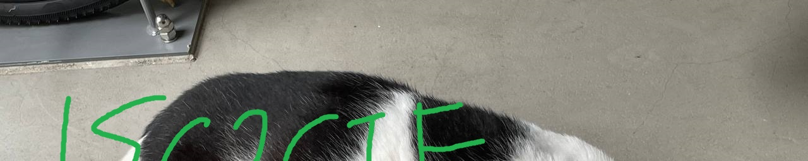
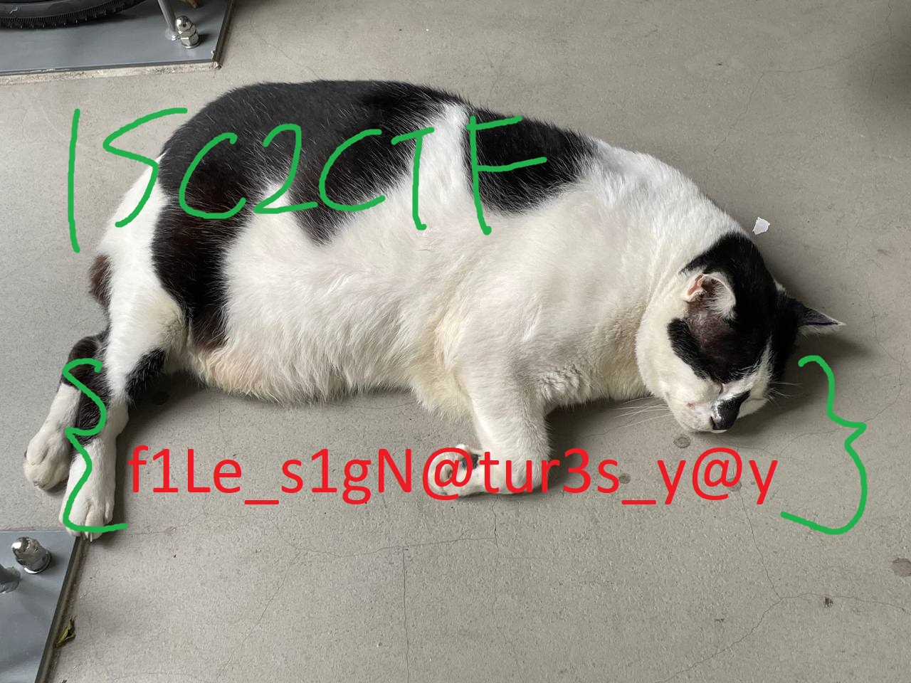

# Solution
Download corrupted

Throw it into a hex editor and notice it has the PNG image file signature but the rest of the bytes resembles the contents of a jpg image file

Repair the file header according to this helpful [wiki](https://en.wikipedia.org/wiki/List_of_file_signatures)
```
FF D8 FF E0 00 10 4A 46 49 46 00 01
```
Output:


Notice the image has been "cut off", there are bytes you can edit to manipulate a ".jpg" file's length and width
| ff c0          | 00 11        | 08       | 01 00        | 05 00        |
|----------------|--------------|----------|--------------|--------------|
| marker identifier | length data | precision | image height | image width  |

Ctrl + F "ff c0" to determine the relevant bytes

In this case, we can just change the image height to a large number like ff 00

Output:


# Final Flag
```
ISC2CTF{f1Le_s1gN@tur3s_y@y}
```
